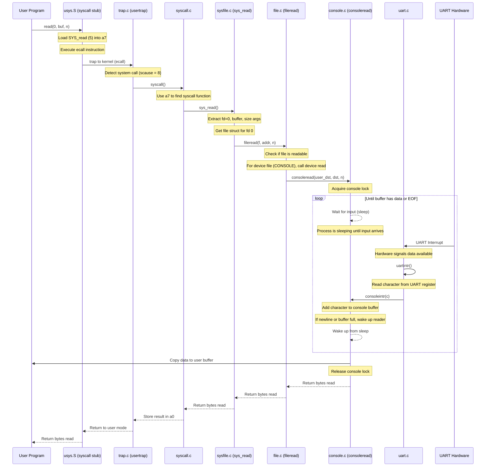

# Read System Call Flow from User to Console Driver

## Key Components

1. **User Program**: Calls `read(0, buf, n)` to read from stdin
2. **System Call Stub**: Generated by usys.pl, sets up registers and executes `ecall`
3. **Trap Handler**: Handles the trap, identifies it as a system call
4. **System Call Dispatcher**: Uses syscall number to call the right function
5. **sys_read**: Extracts arguments and gets the file struct
6. **fileread**: Handles different file types, calls device read for console
7. **consoleread**: Waits for and processes console input
8. **UART Interrupt Handler**: Reads from hardware and feeds to console
9. **Console Buffer**: Stores characters until a full line is ready

## Special Notes

- The process sleeps in `consoleread` until input is available
- Input arrives via interrupts that call `uartintr` → `consoleintr`
- Console input is buffered until a newline or the buffer is full
- File descriptor 0 is set up during process initialization to point to the console device